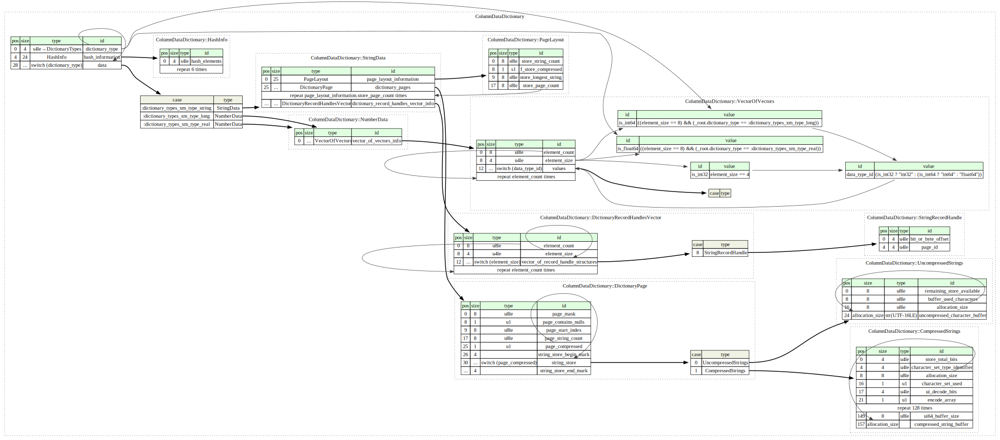

# Code for Parsing Vertipaq Dictionary Files

This repository contains code for parsing `*.dictionary` files, which are part of the Vertipaq storage engine that powers SQL Server Analysis Services (SSAS) and Power BI.

## Features

- **Dictionary Types**: Supports parsing string and numerical based dictinaries. 
- **Dictionary Parsing**: Efficiently parses dictionary files for extracting compressed and uncompressed data.
- **Huffman Tree Decompression**: Implements Huffman Tree-based decompression for reading encoded data.
- **Multi-Page Support**: Handles dictionary files with multiple pages.

## Requirements

To build and run this project, ensure that your system has the following:

- **C++17** or later
- **CMake 3.10** or later
- A compatible C++ compiler (e.g., GCC, Clang, or MSVC)

## Setup

### 1. Clone the Repository

```bash
git clone https://github.com/Hugoberry/pbix-dictionary-compression.git
cd pbix-dictionary-compression
```

### 2. Build the Project
Before building, ensure you have CMake installed. You can then compile the project with the following commands:

```bash
mkdir build
cd build
cmake ..
make
```

### 3. Run the Program
After a successful build, you can run the program by providing the path to a dictionary file as an argument:
```bash
./VertipaqDictionary "../../data/Sales Order Line.dictionary"
```

## Architecture

The code implements the spec described in __*2.3.2 Column Data Dictionary*__ [[MS-XLDM]: Spreadsheet Data Model File Format](https://learn.microsoft.com/en-us/openspecs/office_file_formats/ms-xldm/8c62e8ce-f605-488d-81e9-4ecdb7686a52), which can be visually represented in the diagram below.

